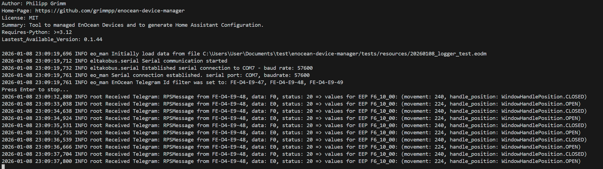

# EnOcean Logger for Commandline

The commandline EnOcean Logger prints out EnOcean telegrams in a nice human readable format. It ignores e.g. Polling telegrams which have more or less little value for debugging and would flood the storage.

There is additionally the option to directly print values of the received telegrams in human readable format like temperature, on-/off-status, brightness, ...
WinExample.png
There is also the possibility to define a filter for telegram IDs which should be printed, other telegrams will be ignored. 

## Prerequisites 
* Install Python
* Install virtual environment (optionally recommended) `python -m venv .venv`
* Install eo_man: `python -m pip install eo_man` 
  
## Arguments
**Hint:** Checkout commandline help: `python -m eo_man -h`

|Short Argument | Argument | Required | Value | Description |
| -------- | ------- | ------- | ------- | ------- |
| -C | --command | required | enocean_logger | Command to activate EnOcean Logger |
| -sp | --serial_port | required | e.g. COM3 or /dev/ttyUSB0 | Serial port which is used for listening for telegrams |
| -dt | --device_type | required | fam14, fgw14usb, fam-usb, enocean-usb300, esp3-gateway | Device type from which telegram are received |
| -idf | --log_telegram_id_filter | optional | e.g. FE-D4-E9-47,FE-D4-E9-48,FE-D4-E9-49 | List of telegram IDs which will be displayed, others will be ignored. |
| -c | --app_config | optional | filename ending with .eodm | Filename from EnOcean Device Manger which gan be stored by using GUI. It contains information about devices and the content of their telegrams which allows the EnOcean Logger to display additional human readable information. |

## Execution
This command just logs all incoming telegrams:
`python -m eo_man -C enocean_logger -sp SERIAL_PORT -dt DEVICE_TYPE`

## How to write logs into file

Just append `> FILENAME.log 2>&1` to your command. The operation system (Linux and Windows) will write into a file.
In parallel you can use  `tail -f FILENAME.log` to check what is newly coming into the file. (Linux only)

## Linux Hints

### How to get access to USB device?

Check permission: `ls -l /dev/ttyUSB0`
Possible Result: `crw-rw---- 1 root dialout 188, 0 /dev/ttyUSB0`

In this case `/dev/ttyUSB0` can be access by group `dialout`.

Add your user to group `dialout`: `sudo usermod -aG dialout $USER`

**YOU MIGHT NEED TO LOG OUT OUR USER OR RESTART YOUR SYSTEM**