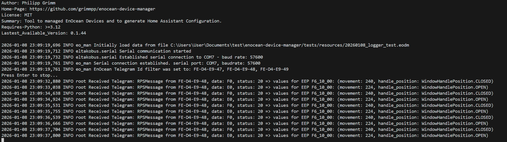

# EnOcean Logger for Commandline (Telegram Monitor)

The commandline EnOcean Logger is a **live telegram monitor**. It prints every EnOcean telegram which appears on
the RS485 bus or in the wireless network in a human readable format, as long as the process runs. It ignores e.g.
polling telegrams which have more or less little value for debugging and would flood the storage.

There is additionally the option to directly print values of the received telegrams in human readable format like
temperature, on-/off-status, brightness, ... . And there is the possibility to define a filter for telegram IDs
which should be printed, other telegrams will be ignored.



## Prerequisites

* Install Python
* Install virtual environment (optionally recommended) `python -m venv .venv`
* Install eo_man: `python -m pip install eo_man`

Alternatively you can run it directly out of this repository, see
[Run directly from this repository](https://github.com/grimmpp/enocean-device-manager#run-directly-from-this-repository-alternative-recommended-for-testing).

## Arguments

**Hint:** Checkout commandline help: `python -m eo_man -h`

|Short Argument | Argument | Required | Value | Description |
| -------- | ------- | ------- | ------- | ------- |
| -C | --command | required | enocean_logger | Command to activate EnOcean Logger |
| -sp | --serial_port | required | e.g. COM3 or /dev/ttyUSB0, for a LAN gateway `IP:PORT` | Serial port which is used for listening for telegrams |
| -dt | --device_type | required | fam14, fgw14usb, fam-usb, enocean-usb300, esp3-gateway, lan | Device type from which telegram are received |
| -idf | --log_telegram_id_filter | optional | e.g. FE-D4-E9-47,FE-D4-E9-48,FE-D4-E9-49 | List of telegram IDs which will be displayed, others will be ignored. |
| -c | --app_config | optional | filename ending with .eodm | Filename from EnOcean Device Manger which gan be stored by using GUI. It contains information about devices and the content of their telegrams which allows the EnOcean Logger to display additional human readable information. |
| -lf | --log_file | optional | e.g. telegrams.log | Additionally write the whole log output - including the received telegrams - into this file. The file is appended, not overwritten. |
| -v | --verbose | optional | - | `-v` adds the debug log of the gateway adapter, `-vv` additionally the debug log of the serial communication. |

## Execution

This command starts the monitor and logs all incoming telegrams until you stop it:

```shell
python -m eo_man -C enocean_logger -sp SERIAL_PORT -dt DEVICE_TYPE
```

Examples:

```shell
# Windows, FGW14-USB on COM3
python -m eo_man -C enocean_logger -sp COM3 -dt fgw14usb

# Linux, wireless transceiver FAM-USB
python -m eo_man -C enocean_logger -sp /dev/ttyUSB0 -dt fam-usb

# LAN gateway
python -m eo_man -C enocean_logger -sp 192.168.0.50:5100 -dt lan

# only the telegrams of two devices
python -m eo_man -C enocean_logger -sp COM3 -dt fgw14usb -idf FE-D4-E9-47,FE-D4-E9-48

# with device names and decoded values taken from a stored application configuration
python -m eo_man -C enocean_logger -sp COM3 -dt fgw14usb -c my_config.eodm
```

One received telegram looks like this:

```text
2026-07-30 16:01:29,938 INFO root Received Telegram: RPSMessage from FE-D4-E9-47, data: 50, status: 30
```

The device name and the decoded values are added when the device is known, i.e. when an application
configuration was loaded with `-c`.

### How to stop it

* **In a console:** press `Enter`, or `Ctrl+C`.
* **Started without a console** (background process, service, `nohup`): the logger writes
  `No console available to stop the logger.` and keeps on logging. Terminate the process to stop it, e.g.
  `kill PID` (Linux/Mac) or `Stop-Process -Id PID` (Windows).

## How to write the telegrams into a file

### Option 1: `--log_file` (recommended)

```shell
python -m eo_man -C enocean_logger -sp COM3 -dt fgw14usb -lf telegrams.log
```

Everything which is printed on the console is written into `telegrams.log` as well. The file is **appended**, so
an existing log is not lost when the monitor is restarted. This works identically on Windows, Linux and Mac.

Watch the file while it is being written (Linux/Mac):

```shell
tail -f telegrams.log
```

Windows PowerShell:

```powershell
Get-Content telegrams.log -Wait -Tail 20
```

### Option 2: redirect the output of the process

The log output is written to **stderr**, so `> FILENAME.log` alone produces an empty file. stderr has to be
redirected as well:

```shell
python -m eo_man -C enocean_logger -sp COM3 -dt fgw14usb > telegrams.log 2>&1
```

To see the telegrams and write them into a file at the same time (Linux/Mac):

```shell
python -m eo_man -C enocean_logger -sp /dev/ttyUSB0 -dt fgw14usb 2>&1 | tee telegrams.log
```

### Option 3: the built-in log file

Independent of the options above the application always writes its log into `enocean-device-manager.log` inside
the installation directory of the package (`eo_man/enocean-device-manager.log`). It is rotated at 10 MB and keeps
2 backups. Use it if you forgot to specify `--log_file`. For a long running monitor prefer `--log_file` because
there you choose the location and the file is not rotated away.

## How to run the monitor as a permanent process

### Linux/Mac: run it in the background

```shell
# start detached, keeps on running after the terminal is closed
nohup python -m eo_man -C enocean_logger -sp /dev/ttyUSB0 -dt fgw14usb -lf telegrams.log > /dev/null 2>&1 &
echo $!            # the process id, needed to stop it later

# follow the telegrams
tail -f telegrams.log

# stop it
kill PID
```

Such a process has no console, so `Enter` cannot stop it - that is why it has to be terminated with `kill`.

### Linux/Mac: run it in a detachable session (`screen` / `tmux`)

Useful if you want to keep the live view and come back to it later:

```shell
screen -S enocean
python -m eo_man -C enocean_logger -sp /dev/ttyUSB0 -dt fgw14usb
# detach with Ctrl+A then D, come back with:
screen -r enocean
```

### Linux: run it as a systemd service

Create `/etc/systemd/system/enocean-logger.service`:

```ini
[Unit]
Description=EnOcean Telegram Monitor
After=network.target

[Service]
Type=simple
User=YOUR_USER
WorkingDirectory=/home/YOUR_USER
ExecStart=/home/YOUR_USER/.venv/bin/python -m eo_man -C enocean_logger -sp /dev/ttyUSB0 -dt fgw14usb -lf /var/log/enocean-telegrams.log
Restart=on-failure
RestartSec=10

[Install]
WantedBy=multi-user.target
```

Then:

```shell
sudo systemctl daemon-reload
sudo systemctl enable --now enocean-logger
sudo systemctl status enocean-logger
journalctl -u enocean-logger -f          # live view of the telegrams
```

Make sure `YOUR_USER` may access the serial port, see *Linux Hints* below.

### Windows: run it in the background

```powershell
# start without a window and write the telegrams into a file
Start-Process -WindowStyle Hidden -FilePath ".\.venv\Scripts\python.exe" `
  -ArgumentList "-m","eo_man","-C","enocean_logger","-sp","COM3","-dt","fgw14usb","-lf","telegrams.log"

# find and stop it
Get-Process python | Format-Table Id, Path
Stop-Process -Id PID
```

For a permanent monitor use the *Task Scheduler* (`taskschd.msc`): create a task with trigger *At startup* and
the same program and arguments as above.

## Linux Hints

### How to get access to USB device?

Check permission: `ls -l /dev/ttyUSB0`
Possible Result: `crw-rw---- 1 root dialout 188, 0 /dev/ttyUSB0`

In this case `/dev/ttyUSB0` can be access by group `dialout`.

Add your user to group `dialout`: `sudo usermod -aG dialout $USER`

**YOU MIGHT NEED TO LOG OUT OUR USER OR RESTART YOUR SYSTEM**

### The serial port changes its name after a reboot

Use a stable device path instead of `/dev/ttyUSB0`:

```shell
ls -l /dev/serial/by-id/
python -m eo_man -C enocean_logger -sp /dev/serial/by-id/usb-FTDI_FT232R_USB_UART_XXXX-if00-port0 -dt fgw14usb
```

## Troubleshooting

| Problem | Cause / Solution |
| ------- | ------- |
| `No connection to gateway ...` and the process ends | Wrong serial port or device type, or the port is already used by another program (e.g. the user interface of this application, or PCT14). Only one program can use the port at a time. |
| The redirected log file stays empty | The output goes to stderr. Use `-lf FILE` or redirect with `2>&1`, see above. |
| No telegram appears at all | Check `-idf`: if a filter is set, only those ids are shown. Remove it to see everything. Also check whether the gateway really receives something. |
| Permission denied on `/dev/ttyUSB0` | Add your user to the `dialout` group, see *Linux Hints*. |
| Telegrams appear but without device name and values | The device is unknown. Pass a stored application configuration with `-c my_config.eodm`. |
