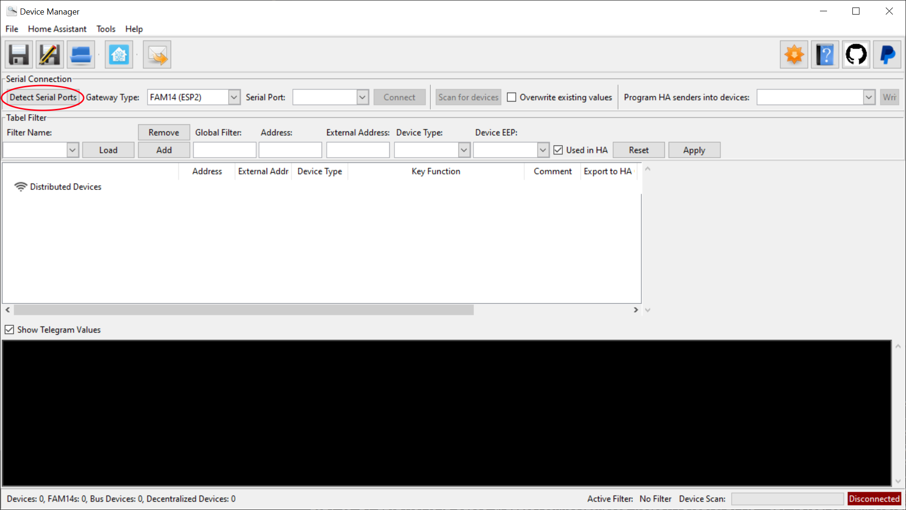
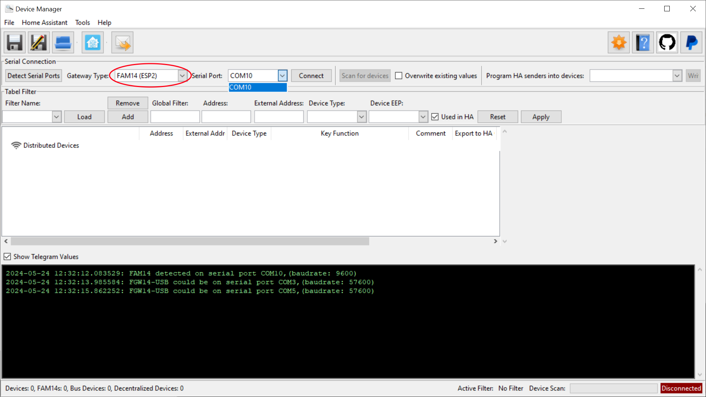
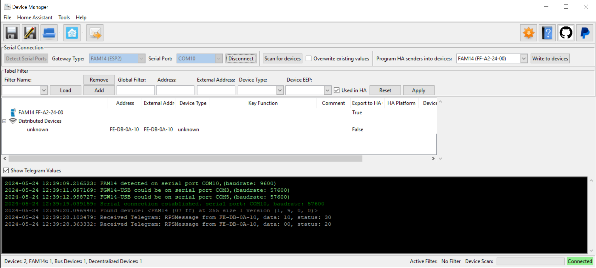
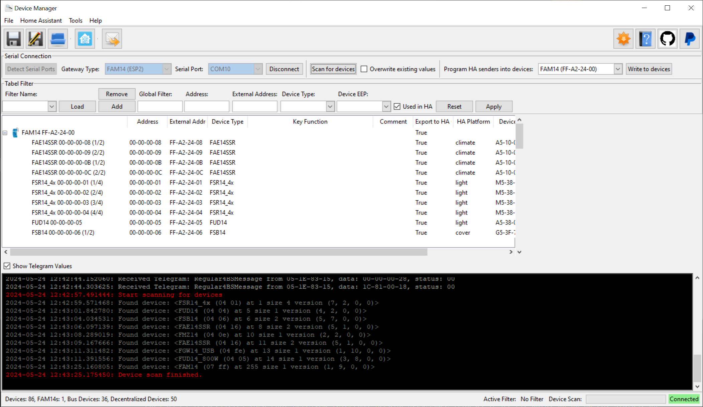
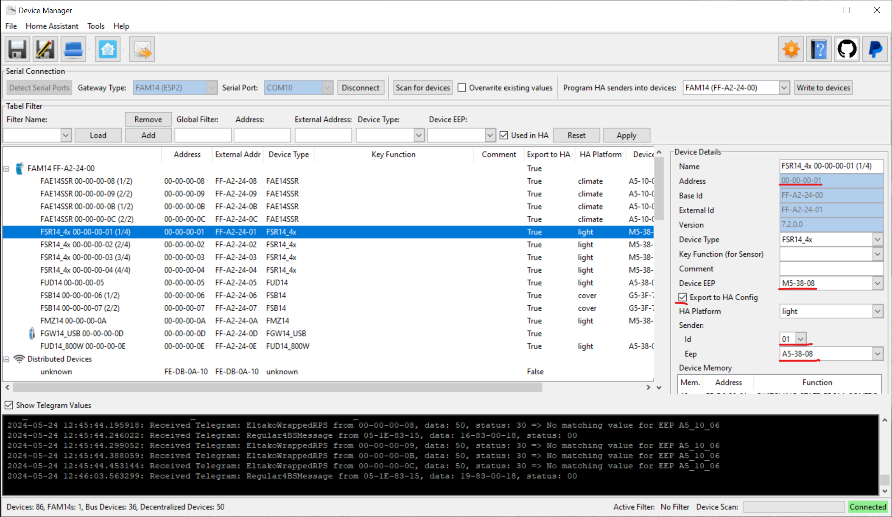
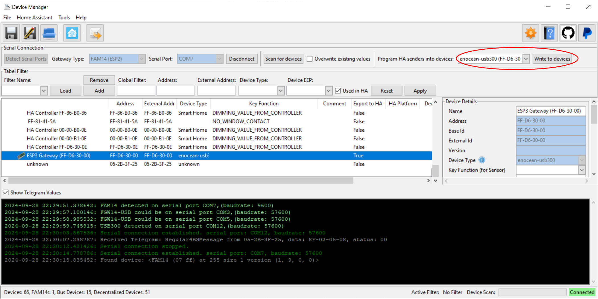
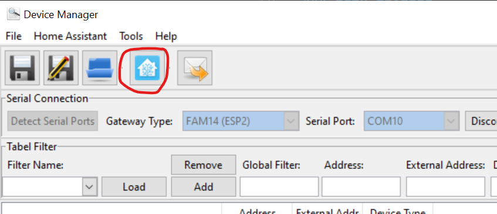

## Getting Started

### Intro
You can use eo_man to detect and manage your EnOcean devices. After you compiled a list of devices you want to use in Home Assistant you can auto-generate a configuration for Home Assistant. 

### Installation
Install eo_man on your PC (not in Home Assistant. This is a standalone application). Plugin all Gateways you want to use in conjunction with Home Assistant.

1. Create virtual python environment: `python.exe -m venv .\.venv`
2. Install application: `.\.venv\Scripts\pip.exe install eo_man  --force-reinstall` (Package available under pypi: [eo_man](https://pypi.org/project/eo-man/))
3. Run application: `.\.venv\Scripts\python.exe -m eo_man`

### Detect Gateway Ports
Ensure gateways you want to use are plugged-in. If you use series 14 bus and if you want to read out the configuration plugin FAM14 via USB cable as well.

Click on `Detect Serial Ports` eo_man will try to find all Gateways connected to your PC. 

### Connect Gateway
Choose the gateway you want to use. In your case FAM14 (controller on the 14 bus) and click connect. 
After being connected you can see all messages from bus and wireless network.

### Scan devices
Messages from devices can now received but unfortunately the message does not say which type the devices is. 
You can change this data by clicking on the devices and changing the values on the right panel. 
For bus devices you can try to do a scan and read the memory of the bus devices by pushing `Scan for devices`. This button is only active if FAM14 is connected. Other gateway cannot read the memory of the bus devices.

### Detect devices during application runtime

After having the devices scanned they should be properly listed with all their attributes:

### Change device values
If you need to change device data manually ensure the following info are set so that it appears late in the Home Assistant configuration:
* Device EEP (defines the message format)
* Export to HA
* HA Platform (device type in HA)
* sender id     (if the device can send out messages it needs an address)
* sender EEP    (if the device can send out messages the message format needs to be defined)

### Support of different Gateway than FAM14 or FGW14-USB
If you want to use another gateway instead of FAM14 or FGW14-USB, you need to plug it into your PC as well and connect it once in eo_man so that it just knows it and can read its address.

### Write Sender Ids into Actuators
In order to make your actuators react on switches in Home Assistant they need to be teached-in. For bus devices it is quite simple you just need to connect with FAM14 again and select the gateway you cant to use in conjunction with Home Assistant later on and push the button 'Write to devices'.
Alternatively and for decentralized devices you need to push the teach-in button in Home Assistant. See docs [here](https://github.com/grimmpp/home-assistant-eltako/tree/main/docs/teach_in_buttons).

In the following example an USB300 is used for Home Assistant and its addresses are teached-in automatically into the bus devices. Decentralized devices need to be teached-in manually like described in the liked docs above. 

### Generate Home Assistant Configuration
To generate the configuration push e.g. the HA shortcut button in the left upper bar or in the `File` menu you can find the button as well.

It automatically creates for all known devices configurations. Don't be confused if you don't need them. You can actually copy all to Home Assistant and then just choose the gateway you want to use. All other configuration will be ignored. 

### Import Configuration into Home Assistant

Open the generated file and copy the content of it into Home Assistant ``/config/configuration.yaml``.
You can also check out the [docs](https://github.com/grimmpp/home-assistant-eltako/blob/main/docs/update_home_assistant_configuration.md) in the repository of [Eltako Integration](https://github.com/grimmpp/home-assistant-eltako)