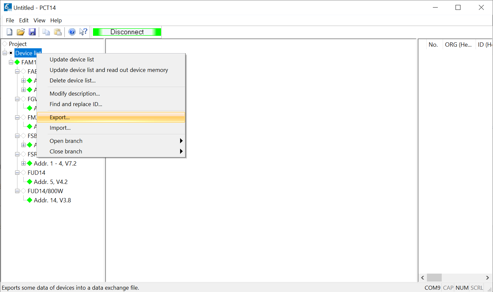
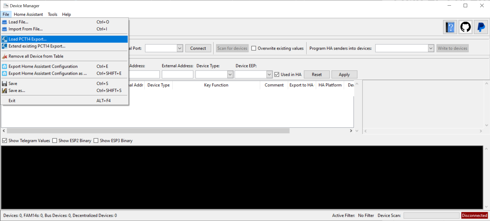
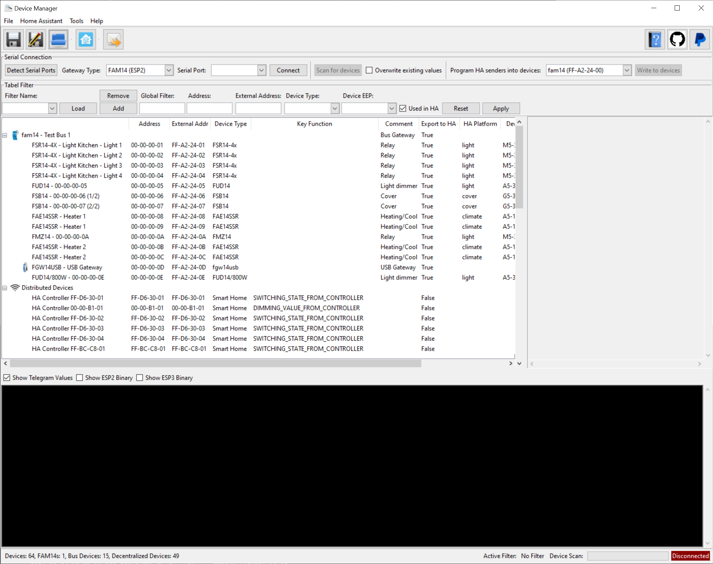
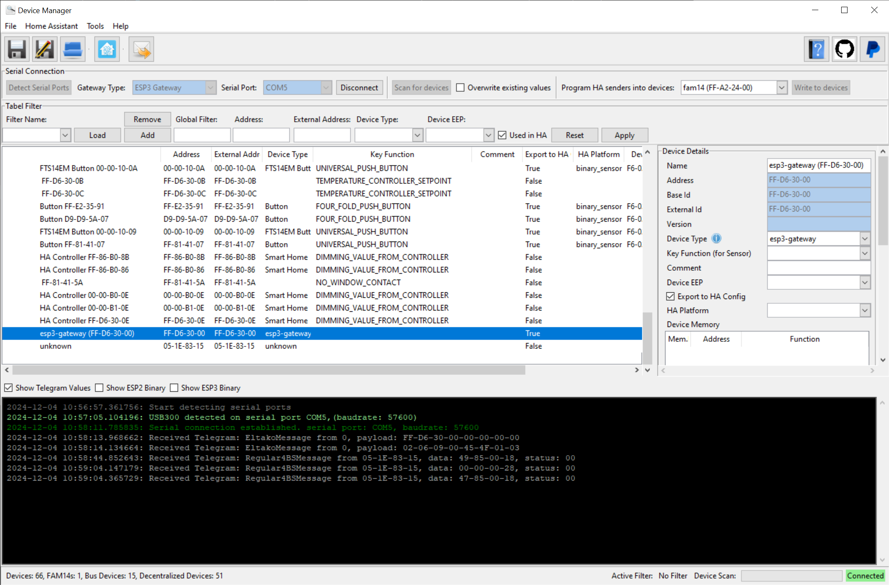

# Load PCT14 Project and generate Home Assistant Configuration

This section describes how to load/import data from PCT14 and how to generate automatically the configuration for Home Assistant.

## Export data from PCT14
As preparation you need to have installed [PCT14](https://www.eltako.com/en/software-pct14/), FAM14 is connected via USB, and all devices are detected and complete memory is read and available in PCT14.

Export the all devices including their memory data by exporting the whole list of devices. You have to store the file in XML format. See screenshot below.

## Load PCT14 Export/XML into eo-man
Open eo-man. You can also extend existing data from an opened eo-man session.
To import the data from PCT14 click on `File -> Load PCT14 Export...` .

After importing the PCT14 export all the devices and their sensors should be visible in the application.

## Add Gateway and modify settings

Most likely, your gateway you want to connect to Home Assistant is not present in the devices list. Now let's add the gateway by simply connecting to it. 
Ensure the gateway is plugged in via USB or is available in the same network. Let eo-man detect the gateways and choose the one to be used by Home Assistant later on. After that simply connect and the gateway should appear in the list automatically.

## Generate Home Assistant Configuration

Before you generate the configuration for Home Assistant you can change some settings if you like and it is always worthful to store the settings (all devices) in eo-man to have some kind of backup.

To generate the configuration for Home Assistant simply click on the Home Assistant icon in the toolbar. eo-man tries to generate as many settings as possible to give you most possibilities. If you want to reduce it you can simply remove the components from the exported file you don't want to use or just ignore/don't use them in Home Assistant.

### Import Configuration into Home Assistant

Open the generated file and copy the content of it into Home Assistant ``/config/configuration.yaml``.
You can also check out the [docs](https://github.com/grimmpp/home-assistant-eltako/blob/main/docs/update_home_assistant_configuration.md) in the repository of [Eltako Integration](https://github.com/grimmpp/home-assistant-eltako)